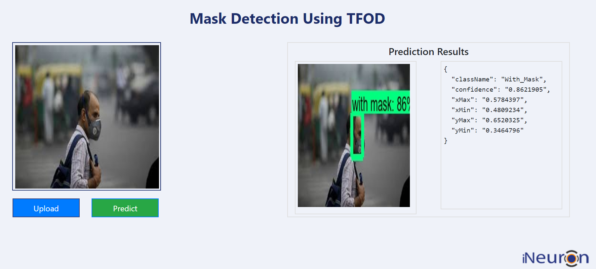
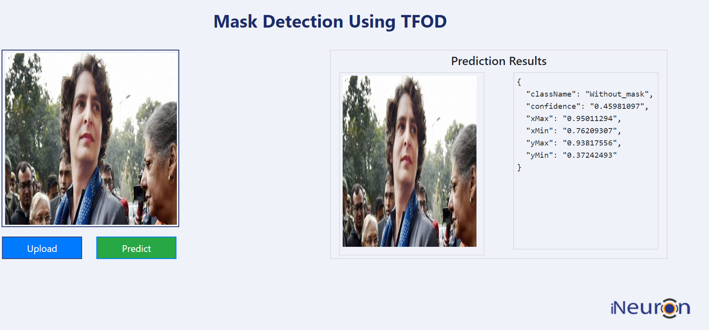

# Mask Detection using TFOD
[https://padhysai.github.io/MaskDetection/](https://padhysai.github.io/MaskDetection/)

### Overview
The utility of masks during the Covid-19 pandemic seems widely accepted now. The dominant scientific opinion says masks are very useful, and even relatively simple home-made masks can offer a great degree of protection against the novel coronavirus. With several countries like Singapore, Japan, states, and cities in the United States like Texas and New York making wearing masks mandatory for the public there comes a need for an automated system that is capable of helping authorities maintain guidelines which is where we can hope to turn to computer vision for a solution.

### Architecture
Google has released [Object detection API for tensorflow](https://github.com/tensorflow/models/tree/master/research/object_detection), it comes with several pre-trained models with pre-implemented architectures which are trained on COCO dataset.

Some of the popular pre trained architectures are :

 1. [ssd_mobilenet_v1_coco](http://download.tensorflow.org/models/object_detection/ssd_mobilenet_v1_coco_2018_01_28.tar.gz)
 2. [ssd_mobilenet_v2_coco](http://download.tensorflow.org/models/object_detection/ssd_mobilenet_v2_coco_2018_03_29.tar.gz)
 3. [ssd_inception_v2_coco](http://download.tensorflow.org/models/object_detection/ssd_inception_v2_coco_2018_01_28.tar.gz)
 4. [faster_rcnn_resnet50_coco](http://download.tensorflow.org/models/object_detection/faster_rcnn_resnet50_coco_2018_01_28.tar.gz)
 5. [faster_rcnn_inception_v2_coco](http://download.tensorflow.org/models/object_detection/faster_rcnn_inception_v2_coco_2018_01_28.tar.gz)
 6. [faster_rcnn_resnet101_coco](http://download.tensorflow.org/models/object_detection/faster_rcnn_resnet101_coco_2018_01_28.tar.gz)
 
 You can download pre-implemented architectures [here](https://github.com/tensorflow/models/blob/master/research/object_detection/g3doc/detection_model_zoo.md).

All these architectures are based on CNN neural networks and trained on ImageNet dataset. Here, i am using [ssd_mobilenet_v1_coco](http://download.tensorflow.org/models/object_detection/ssd_mobilenet_v1_coco_2018_01_28.tar.gz) for this project.

### Data Description

I have collected 1500 images which consists of persons with mask and without mask by scraping from different sources available like Google, bing images and pintrest images.

#### DataSet Size

 

 - Total Number of Images : 1523
 - Total Number of Training images : 1223
 - Total Number of Test Images : 300
 - No of Categories:

 1. Persons with Mask
 2. Persons without Mask

To make my model robust and to detect in situation i used [Augmentor](https://github.com/mdbloice/Augmentor) Library for Data augmentation and for Data Annotation i used LabelImg tool.

After the training completed, i deployed my model to Pivotal cloud services.

 1. Visit this project through [https://maskdetection-brave-serval-ut.cfapps.io/](https://maskdetection-brave-serval-ut.cfapps.io/)

Here are the some snapshots of the Predictions:
Person With Mask:

Person Without Mask

### Credits
- Tensorflow API for Object detection.
- Object Detection Models by [INEURON.ai](http://ineuron.ai/) 
